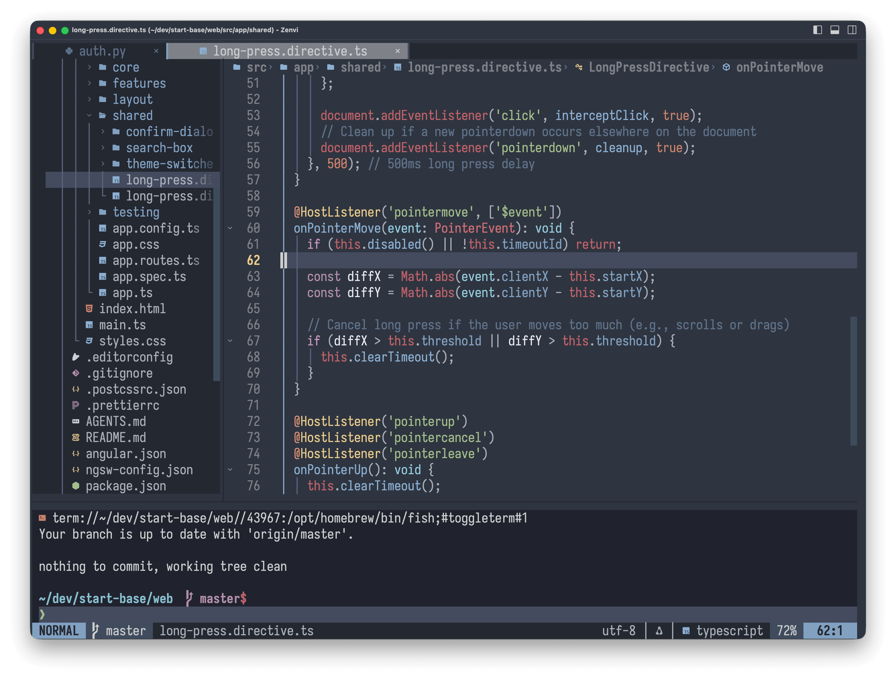

<div align="center">

  # Zenvi 

  

  **A Neovim GUI frontend built with [GPUI](https://gpui.rs/).**



</div>

---

## Features

- **Embedded Neovim** — Runs `nvim --embed` via MessagePack-RPC. Your `init.lua`, plugins, Treesitter, and LSP configs work as-is.
- **GPU Rendering** — Uses GPUI with Metal (macOS) / Vulkan.
- **Theme Synchronization** — Titlebar, borders, and menus dynamically derive colors from Neovim's active colorscheme.
- **CLI Integration** — Install `zenvi` command via menu (`Zenvi -> Install Shell Command`), then open files or directories from terminal (`zenvi .`, `zenvi file.rs`).
- **Neovim Hot Reload** — Reload Neovim session via `Zenvi -> Reload Neovim` or `Cmd+Shift+R`. Supports [auto-session](https://github.com/rmagatti/auto-session) state save/restore.
- **Collapsible Panels** — Dedicated titlebar toggle buttons for left, bottom, and right panels with dynamic icon states and bidirectional synchronization. Left panel defaults to [neo-tree.nvim](https://github.com/nvim-neo-tree/neo-tree.nvim), bottom panel defaults to embedded terminal, and right panel supports custom functions.
- **Delicate Statusline** — Renders the statusline independently at the bottom of the window, with support for custom fonts and sizes.
- **`guifont` Support** — Set font via `vim.opt.guifont` in `init.lua`. Injects `vim.g.zenvi = true` and `vim.g.gui_running = 1` on startup.

---

## 📦 Installation

### Pre-built Binaries (macOS)

Download the latest `.dmg` from [GitHub Releases](https://github.com/harryxu/zenvi/releases):

#### ⚠️ macOS Gatekeeper Warning

Because Zenvi is an open-source project and is not signed with an Apple Developer ID, macOS Gatekeeper will block launch and display:
> *"Apple cannot verify that 'Zenvi.app' is free of malware that may harm your Mac or compromise your privacy."*

To permit Zenvi to run, remove the quarantine attribute via Terminal:

```bash
xattr -cr /Applications/Zenvi.app
```

Alternatively, open **System Settings -> Privacy & Security -> Security**, scroll down to find the message stating *“Zenvi was blocked...”*, and click **Open Anyway**.

---

## 🛠️ Building from Source

If you prefer to compile Zenvi locally:

### Prerequisites

- **Rust**: `1.98.0+` ([rustup.rs](https://rustup.rs/))
- **Neovim**: `0.9.0+` 

### Build

```bash
git clone https://github.com/harryxu/zenvi.git
cd zenvi
cargo build --release
```

### Packaging macOS `.app` 

```bash
# Build Zenvi.app bundle in target/Zenvi.app
make macapp

# Build macOS .dmg installer in target/
make dmg
```

### Packaging Linux (`.tar.gz` & `.AppImage`)

```bash
# Build standalone Linux AppImage in target/
make appimage

# Or build both .tar.gz bundle and .AppImage
make linux
```


---

## ⚙️ Configuration (in `init.lua`)

Zenvi sets `vim.g.zenvi = true` and `vim.g.gui_running = 1` upon startup.

### Font

You can configure your GUI font and line spacing directly in your Neovim configuration (`~/.config/nvim/init.lua`):

```lua
if vim.g.zenvi then
  -- Set font family and font size
  vim.opt.guifont = "JetBrainsMono Nerd Font:h15"
  
  -- Optional: add extra pixel line spacing
  vim.opt.linespace = 2
end
```

### Delicate Statusline

Zenvi can hide Neovim's built-in statusline (`laststatus = 0`) and render it as an independent component at the bottom of the window, allowing you to use a different font or font size for the statusline than the main editor.

#### Configuration in `init.lua`

```lua
if vim.g.zenvi then
  -- Enable/disable (default: true)
  vim.g.zenvi_delicate_statusline = true

  -- Custom font and size using standard guifont syntax (default size: 16)
  vim.g.zenvi_delicate_statusline_font = "SF Pro Text:h16"
  -- Or font only: "JetBrainsMono Nerd Font"
  -- Or size only: ":h14"
end
```

Launch with `--no-delicate-statusline` to disable:
```bash
zenvi --no-delicate-statusline
```

### Left Panel Toggle (`toggle_left_panel`)

Zenvi provides a left panel toggle button on the right side of the titlebar. The button dynamically switches icons (`panel-left` vs `panel-left-open`) based on whether the panel is currently open.

#### Default Behavior
If no custom function is specified, Zenvi defaults to toggling **[neo-tree.nvim](https://github.com/nvim-neo-tree/neo-tree.nvim)** (`neo-tree.command.execute({ toggle = true, position = "left" })`). If `neo-tree` is not installed and no custom function is set, a helpful notification warning is displayed via `vim.notify`.

#### Built-in API & Commands
- **Lua function**: `zenvi.toggle_left_panel()`
- **Ex command**: `:ZenviToggleLeftPanel`
- **State query**: `zenvi.is_left_panel_open()`

#### Custom Panel Function
You can customize the toggle function and state detection in your `init.lua`:

```lua
if vim.g.zenvi then
  -- Define custom toggle logic (Lua function or Ex command string)
  vim.g.zenvi_toggle_left_panel = function()
    require("nvim-tree.api").tree.toggle()
  end
  -- Or as an Ex command string:
  -- vim.g.zenvi_toggle_left_panel = "NvimTreeToggle"

  -- Optional: Define custom state detection (returns boolean)
  vim.g.zenvi_is_left_panel_open = function()
    return require("nvim-tree.api").tree.is_visible()
  end
end
```

### Bottom Panel Toggle (`toggle_bottom_panel`)

Zenvi provides a bottom panel toggle button located in the middle of the panel control group on the titlebar. The button dynamically switches icons (`panel-bottom` vs `panel-bottom-open`) based on whether the bottom panel is currently open.

#### Default Behavior
The default behavior is toggling an embedded **Neovim terminal** (using native `:botright 12split | terminal` or [toggleterm.nvim](https://github.com/akinsho/toggleterm.nvim) if installed). Toggling it open starts or displays the terminal, and toggling it again closes the window while preserving active shell jobs.

#### Built-in API & Commands
- **Lua function**: `zenvi.toggle_bottom_panel()`
- **Ex command**: `:ZenviToggleBottomPanel`
- **State query**: `zenvi.is_bottom_panel_open()`

#### Custom Panel Function
You can customize the toggle function in your `init.lua`:

```lua
if vim.g.zenvi then
  -- Define custom toggle logic (Lua function or Ex command string)
  vim.g.zenvi_toggle_bottom_panel = function()
    -- Example: toggle trouble.nvim or custom terminal
    require("trouble").toggle()
  end
  -- Or as an Ex command string:
  -- vim.g.zenvi_toggle_bottom_panel = "Trouble toggle"

  -- Optional: Define custom state detection (returns boolean)
  vim.g.zenvi_is_bottom_panel_open = function()
    return require("trouble").is_open()
  end
end
```

### Right Panel Toggle (`toggle_right_panel`)

Zenvi provides a right panel toggle button on the right side of the titlebar next to the left panel button. The button dynamically switches icons (`panel-right` vs `panel-right-open`) based on whether the panel is currently open.

#### Behavior & Notification
The right panel has no hardcoded default plugin. If clicked when no custom toggle function is defined, a notification warning is displayed prompting you to set `vim.g.zenvi_toggle_right_panel`.

#### Built-in API & Commands
- **Lua function**: `zenvi.toggle_right_panel()`
- **Ex command**: `:ZenviToggleRightPanel`
- **State query**: `zenvi.is_right_panel_open()`

#### Configuration Example
In your `init.lua`:

```lua
if vim.g.zenvi then
  -- Define custom toggle logic (Lua function or Ex command string)
  vim.g.zenvi_toggle_right_panel = function()
    -- Example: toggle an outline or symbol inspector plugin
    require("aerial").toggle()
  end
  -- Or as an Ex command string:
  -- vim.g.zenvi_toggle_right_panel = "AerialToggle"

  -- Optional: Define custom state detection (returns boolean)
  vim.g.zenvi_is_right_panel_open = function()
    -- Return true if the panel is currently open, false otherwise
    return false
  end
end
```

### Other options

#### `vim.opt.zenvi_prewarm_max_lines`

Pre-warms all off-screen lines into Zenvi's 64-bit FNV-1a content_cache, once per buffer when opening files <= zenvi_prewarm_max_lines (default 1000), set `0` to disable pre-warming.

